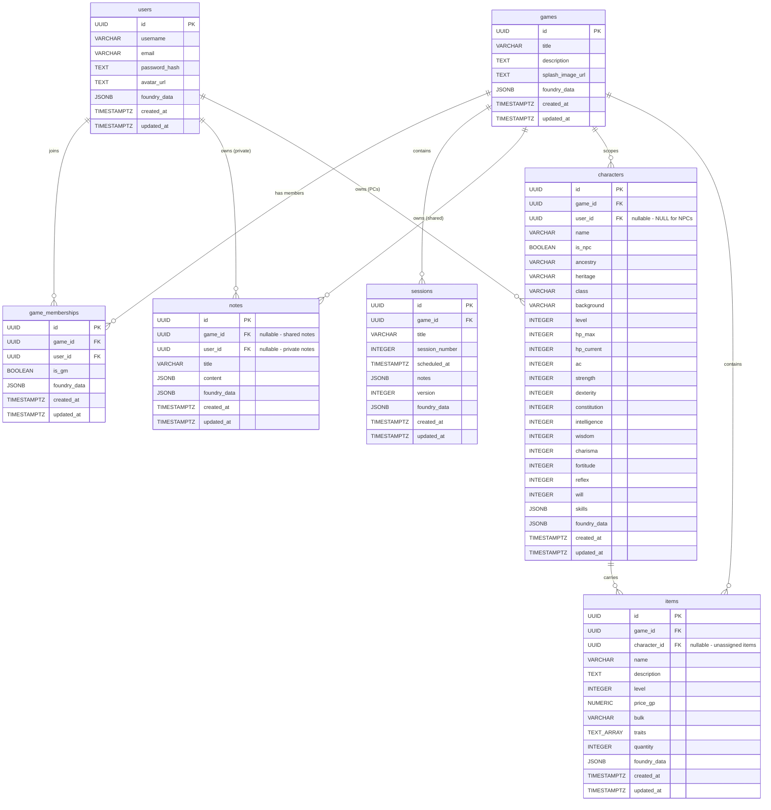

# Database Schema Design Document

## 1. Introduction

This document defines the foundational database schema for the Pathfinder 2E companion application. It serves as the authoritative design artifact that must be agreed upon before any implementation begins.

**Target platform:** PostgreSQL

**v1 scale assumption:** Fewer than 100 concurrent users are anticipated. Performance and indexing optimizations — including GIN indexes on `jsonb` columns, soft-delete patterns, and large note payload handling — are deferred beyond basic primary and foreign key indexes. This assumption provides a clear baseline from which future iterations can reassess.

**Consumer:** The schema will be consumed by a REST API. No ORM-specific conventions are imposed at the schema level.

---

## 2. Conventions

The following standards apply consistently throughout the schema.

| Convention | Rule |
|---|---|
| **Casing** | `snake_case` for all table and column names |
| **Table names** | Plural (e.g. `users`, `games`, `sessions`) |
| **Primary keys** | `id UUID DEFAULT gen_random_uuid() PRIMARY KEY` on every table. UUID is chosen for REST-friendliness, safe client-side generation, and avoidance of sequential-ID enumeration. |
| **Foreign keys** | Named as `<referenced_table_singular>_id` (e.g. `game_id`, `user_id`) |
| **Timestamps** | Every table includes `created_at TIMESTAMPTZ NOT NULL DEFAULT now()` and `updated_at TIMESTAMPTZ NOT NULL DEFAULT now()` |
| **Foundry VTT column** | Every table includes `foundry_data JSONB` — nullable, intended to support Foundry VTT import/export workflows. The internal structure of this column is deferred; its presence is reserved so that future iterations can define the payload without schema migrations. |

---

## 3. Entity-Relationship Diagram



> **Notes dual-ownership:** The `notes` table has two nullable foreign keys (`game_id` and `user_id`). A shared note has `game_id` set and `user_id` null; a private note has `user_id` set and `game_id` null. A CHECK constraint enforces that exactly one is non-null per record.

> **Items nullable FK:** The `character_id` on `items` is nullable, allowing items to exist without an assigned owner to support unassigned loot pools, shop inventories, or game-level item collections.

---

## 4. Entity Breakdown

### 4.1 `users`

Represents an authenticated user of the application. There is a single user type; GM status is determined per-game via `game_memberships`, not as a global role.

| Column | Type | Nullable | Default | Description |
|---|---|---|---|---|
| `id` | `UUID` | NO | `gen_random_uuid()` | Primary key |
| `username` | `VARCHAR(100)` | NO | — | Unique display name |
| `email` | `VARCHAR(255)` | NO | — | Unique email for authentication |
| `password_hash` | `TEXT` | NO | — | Hashed password (never stored in plain text) |
| `avatar_url` | `TEXT` | YES | `NULL` | Profile image URL |
| `foundry_data` | `JSONB` | YES | `NULL` | Foundry VTT import/export payload (structure deferred) |
| `created_at` | `TIMESTAMPTZ` | NO | `now()` | Row creation timestamp |
| `updated_at` | `TIMESTAMPTZ` | NO | `now()` | Last modification timestamp |

**Constraints:**

- `UNIQUE(username)`
- `UNIQUE(email)`

---

### 4.2 `games`

The master entity that owns all other game-scoped data. Represents a single Pathfinder 2E campaign.

| Column | Type | Nullable | Default | Description |
|---|---|---|---|---|
| `id` | `UUID` | NO | `gen_random_uuid()` | Primary key |
| `title` | `VARCHAR(255)` | NO | — | Game/campaign name |
| `description` | `TEXT` | YES | `NULL` | Campaign summary or description |
| `splash_image_url` | `TEXT` | YES | `NULL` | Splash screen image URL |
| `foundry_data` | `JSONB` | YES | `NULL` | Foundry VTT import/export payload (structure deferred) |
| `created_at` | `TIMESTAMPTZ` | NO | `now()` | Row creation timestamp |
| `updated_at` | `TIMESTAMPTZ` | NO | `now()` | Last modification timestamp |

---

### 4.3 `game_memberships`

Join table representing user participation within a game. The `is_gm` flag grants GM status on a per-game basis, meaning a user can be a GM in one game and a player in another, or a GM in multiple games simultaneously.

| Column | Type | Nullable | Default | Description |
|---|---|---|---|---|
| `id` | `UUID` | NO | `gen_random_uuid()` | Primary key |
| `game_id` | `UUID` | NO | — | FK → `games.id` |
| `user_id` | `UUID` | NO | — | FK → `users.id` |
| `is_gm` | `BOOLEAN` | NO | `FALSE` | Whether this user is a GM for this game |
| `foundry_data` | `JSONB` | YES | `NULL` | Foundry VTT import/export payload (structure deferred) |
| `created_at` | `TIMESTAMPTZ` | NO | `now()` | Row creation timestamp |
| `updated_at` | `TIMESTAMPTZ` | NO | `now()` | Last modification timestamp |

**Constraints:**

- `UNIQUE(game_id, user_id)` — a user can join a given game only once.

---

### 4.4 `sessions`

Time-bounded entries belonging to a game, representing individual play sessions. Session notes are stored in a JSON format to support rich-text styling.

| Column | Type | Nullable | Default | Description |
|---|---|---|---|---|
| `id` | `UUID` | NO | `gen_random_uuid()` | Primary key |
| `game_id` | `UUID` | NO | — | FK → `games.id` |
| `title` | `VARCHAR(255)` | NO | — | Session title |
| `session_number` | `INTEGER` | YES | `NULL` | Optional ordering index |
| `scheduled_at` | `TIMESTAMPTZ` | YES | `NULL` | Scheduled start time |
| `notes` | `JSONB` | YES | `NULL` | Styled session notes (JSON for rich-text content) |
| `version` | `INTEGER` | NO | `1` | Basic version counter (full snapshot/versioning support deferred) |
| `foundry_data` | `JSONB` | YES | `NULL` | Foundry VTT import/export payload (structure deferred) |
| `created_at` | `TIMESTAMPTZ` | NO | `now()` | Row creation timestamp |
| `updated_at` | `TIMESTAMPTZ` | NO | `now()` | Last modification timestamp |

---

### 4.5 `notes`

General-purpose sticky-style notes not tied to a specific session. Notes support two ownership models: **shared notes** visible and editable by all game members, and **private notes** visible and editable only by the owning user.

| Column | Type | Nullable | Default | Description |
|---|---|---|---|---|
| `id` | `UUID` | NO | `gen_random_uuid()` | Primary key |
| `game_id` | `UUID` | YES | `NULL` | FK → `games.id` — set for **shared** (game-level) notes |
| `user_id` | `UUID` | YES | `NULL` | FK → `users.id` — set for **private** (player-level) notes |
| `title` | `VARCHAR(255)` | NO | — | Note title |
| `content` | `JSONB` | YES | `NULL` | Rich-text note body (JSON format) |
| `foundry_data` | `JSONB` | YES | `NULL` | Foundry VTT import/export payload (structure deferred) |
| `created_at` | `TIMESTAMPTZ` | NO | `now()` | Row creation timestamp |
| `updated_at` | `TIMESTAMPTZ` | NO | `now()` | Last modification timestamp |

**Constraint — dual ownership:**

Exactly one of `game_id` or `user_id` must be non-null per record. This is enforced with a CHECK constraint:

```sql
CHECK (
  (game_id IS NOT NULL AND user_id IS NULL)
  OR (game_id IS NULL AND user_id IS NOT NULL)
)
```

- **Shared notes** (`game_id` non-null, `user_id` null): Owned at the game level. All players within the game may view and edit these notes.
- **Private notes** (`user_id` non-null, `game_id` null): Owned by a specific player. Only the owning user (and GMs of games they participate in) may view and edit these notes.

---

### 4.6 `characters`

Represents both player characters (PCs) and non-player characters (NPCs). For v1, characters are scoped to a single game via a direct `game_id` foreign key; cross-game character support is deferred to a future iteration.

PC attributes cover the core stat block only: ability scores, AC, HP, saves, skills, level, ancestry, heritage, class, and background. Full character sheet support is explicitly out of scope for this iteration.

| Column | Type | Nullable | Default | Description |
|---|---|---|---|---|
| `id` | `UUID` | NO | `gen_random_uuid()` | Primary key |
| `game_id` | `UUID` | NO | — | FK → `games.id` (v1: single-game scope) |
| `user_id` | `UUID` | YES | `NULL` | FK → `users.id` — owner; NULL for NPCs controlled by the GM |
| `name` | `VARCHAR(255)` | NO | — | Character name |
| `is_npc` | `BOOLEAN` | NO | `FALSE` | TRUE for NPCs, FALSE for PCs |
| `ancestry` | `VARCHAR(100)` | YES | `NULL` | e.g. "Elf", "Human" |
| `heritage` | `VARCHAR(100)` | YES | `NULL` | e.g. "Ancient Elf", "Versatile Human" |
| `class` | `VARCHAR(100)` | YES | `NULL` | e.g. "Wizard", "Fighter" |
| `background` | `VARCHAR(100)` | YES | `NULL` | e.g. "Scholar", "Acolyte" |
| `level` | `INTEGER` | NO | `1` | Character level (1–20) |
| `hp_max` | `INTEGER` | YES | `NULL` | Maximum hit points |
| `hp_current` | `INTEGER` | YES | `NULL` | Current hit points |
| `ac` | `INTEGER` | YES | `NULL` | Armor class |
| `strength` | `INTEGER` | YES | `NULL` | Ability score |
| `dexterity` | `INTEGER` | YES | `NULL` | Ability score |
| `constitution` | `INTEGER` | YES | `NULL` | Ability score |
| `intelligence` | `INTEGER` | YES | `NULL` | Ability score |
| `wisdom` | `INTEGER` | YES | `NULL` | Ability score |
| `charisma` | `INTEGER` | YES | `NULL` | Ability score |
| `fortitude` | `INTEGER` | YES | `NULL` | Fortitude save modifier |
| `reflex` | `INTEGER` | YES | `NULL` | Reflex save modifier |
| `will` | `INTEGER` | YES | `NULL` | Will save modifier |
| `skills` | `JSONB` | YES | `NULL` | Skill proficiencies and modifiers (structured JSON — PF2E has a large and extensible skill list) |
| `foundry_data` | `JSONB` | YES | `NULL` | Foundry VTT import/export payload (structure deferred) |
| `created_at` | `TIMESTAMPTZ` | NO | `now()` | Row creation timestamp |
| `updated_at` | `TIMESTAMPTZ` | NO | `now()` | Last modification timestamp |

---

### 4.7 `items`

Represents items players own, carry, or may wish to acquire. The schema covers the fields needed to represent a Pathfinder 2E item stat block at v1 scope.

The `character_id` foreign key is **nullable**, allowing items to exist without an assigned owner in order to support unassigned loot pools, shop inventories, or game-level item collections.

| Column | Type | Nullable | Default | Description |
|---|---|---|---|---|
| `id` | `UUID` | NO | `gen_random_uuid()` | Primary key |
| `game_id` | `UUID` | NO | — | FK → `games.id` |
| `character_id` | `UUID` | YES | `NULL` | FK → `characters.id` — nullable for unassigned items |
| `name` | `VARCHAR(255)` | NO | — | Item name |
| `description` | `TEXT` | YES | `NULL` | Flavour text or rules description |
| `level` | `INTEGER` | NO | `0` | Item level |
| `price_gp` | `NUMERIC(10,2)` | YES | `NULL` | Price in gold pieces |
| `bulk` | `VARCHAR(10)` | YES | `NULL` | PF2E bulk value (e.g. `"1"`, `"L"`, `"—"`) |
| `traits` | `TEXT[]` | YES | `NULL` | Array of trait tags (e.g. `{"magical", "invested"}`) |
| `quantity` | `INTEGER` | NO | `1` | Stack count |
| `foundry_data` | `JSONB` | YES | `NULL` | Foundry VTT import/export payload (structure deferred) |
| `created_at` | `TIMESTAMPTZ` | NO | `now()` | Row creation timestamp |
| `updated_at` | `TIMESTAMPTZ` | NO | `now()` | Last modification timestamp |

**Note:** Consumable-specific attributes and special item properties are deferred to a future iteration.

---

## 5. Relationships

### 5.1 Users ↔ Games (many-to-many via `game_memberships`)

A user can participate in many games; a game has many users. The relationship is modelled through the `game_memberships` join table, which carries an `is_gm` boolean flag. This flag grants GM status on a **per-game** basis rather than as a global role, meaning:

- A user can be a GM in one game and a regular player in another.
- A user can hold GM status in multiple games simultaneously.
- Multiple users can be GMs within the same game.

The `UNIQUE(game_id, user_id)` constraint ensures a user can only have one membership record per game.

### 5.2 Games → Sessions (one-to-many)

Each session belongs to exactly one game via the `game_id` foreign key. A game can have many sessions. Sessions represent individual play sessions within a campaign and are ordered optionally via `session_number`.

### 5.3 Notes — Dual Ownership

Notes use a dual-ownership model enforced by a CHECK constraint requiring exactly one of `game_id` or `user_id` to be non-null:

- **Shared notes** (`game_id` non-null, `user_id` null): Owned at the game level. All players within the game may view and edit these notes. The `game_id` foreign key links to `games.id`.
- **Private notes** (`user_id` non-null, `game_id` null): Owned by a specific player. Only the owning user may edit these notes. The `user_id` foreign key links to `users.id`.

GMs have full read/write access to all notes within their game, regardless of ownership model.

### 5.4 Games → Characters (one-to-many)

Characters are scoped to a single game via the `game_id` foreign key. This is a v1 simplification; cross-game character support (e.g. the same character appearing in multiple campaigns) is deferred to a future iteration.

### 5.5 Users → Characters (one-to-many, nullable)

Player characters (PCs) have a `user_id` foreign key linking them to their owning user. Non-player characters (NPCs) may have `user_id` set to null, indicating they are controlled by the GM rather than owned by a specific player. The `is_npc` boolean flag provides an explicit marker for this distinction.

### 5.6 Characters → Items (one-to-many, nullable FK)

Items optionally belong to a character via the `character_id` foreign key. This foreign key is **nullable** to support:

- **Unassigned loot pools** — items found but not yet claimed by a character.
- **Shop inventories** — items available for purchase within the game world.
- **Game-level item collections** — items tracked at the campaign level without a specific owner.

All items always belong to a game via the non-nullable `game_id` foreign key, ensuring they remain scoped to the correct campaign regardless of character assignment.

### 5.7 Access Control Summary

Access control is enforced through foreign keys to `users` and the `is_gm` flag on `game_memberships`:

| Role | Scope | Permissions |
|---|---|---|
| **GM** | All entities within their game | Full read/write access |
| **Player** | Game-level data | Read access |
| **Player** | Own characters | Read/write access |
| **Player** | Own private notes | Read/write access |
| **Player** | Shared (game-level) notes | Read/write access |

All game data is private to the owning game by default. Cross-game data visibility is not supported in v1.

---

## 6. Deferred Items

The following items are explicitly out of scope for v1 and deferred to future iterations:

| Item | Rationale |
|---|---|
| **Foundry VTT `jsonb` internal structure** | The `foundry_data` column is reserved on every table; its payload schema will be defined when Foundry VTT integration work begins. |
| **GIN indexes on `jsonb` columns** | Not needed at v1 scale (<100 concurrent users). Will be reassessed as data volume grows. |
| **Soft-delete patterns** | Adds complexity without clear v1 need. Can be added via an `archived_at` column in a future migration. |
| **Session snapshot/versioning** | The `version` counter is present for basic tracking. Full snapshot and revert support requires a dedicated audit/history table design. |
| **Consumable-specific item attributes** | Items cover the base stat block only. Consumable properties (doses, activation actions) are deferred. |
| **Cross-game character support** | Characters are scoped to a single game via `game_id`. A future `character_templates` or linking table can enable cross-game reuse. |
| **Full character sheet support** | Only core stat block fields are included. Feats, spells, inventory management, and condition tracking are deferred. |
| **Large note payload handling / pagination** | At v1 scale, `JSONB` note content is returned in full. Pagination or streaming for large payloads will be addressed if needed. |
