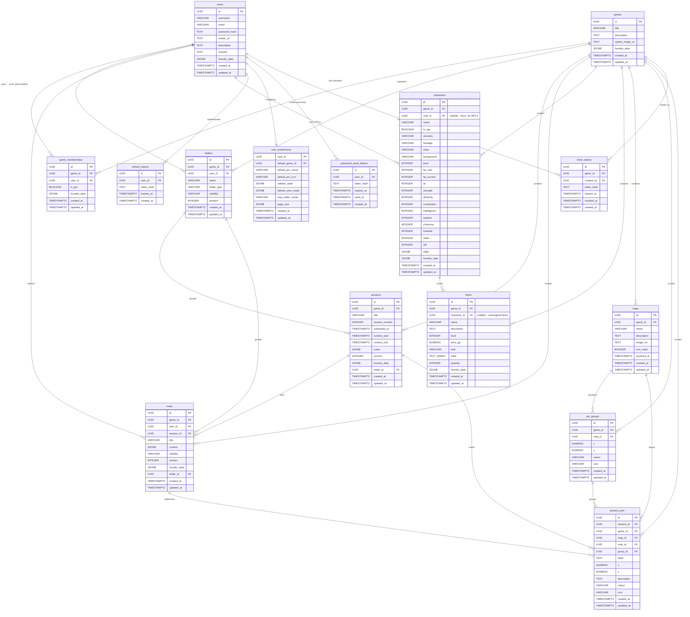

# Database Schema Design Document

## 1. Introduction

This document defines the database schema for the Pathfinder 2E companion application. It serves as the authoritative reference that reflects the implemented schema across all Flyway migrations (`V1__initial_schema.sql`, `V1.001__password_reset_tokens.sql`, `V1.002__invite_tokens.sql`).

**Target platform:** PostgreSQL 14+

**v1 scale assumption:** Fewer than 100 concurrent users are anticipated. Performance and indexing optimizations — including GIN indexes on `jsonb` columns and large note payload handling — are deferred beyond basic primary key, foreign key, and partial unique indexes. This assumption provides a clear baseline from which future iterations can reassess.

**Consumer:** The schema is consumed by a REST API backed by a Go/GORM backend. No ORM-specific conventions are imposed at the schema level.

**Tables (14):** `users`, `games`, `game_memberships`, `folders`, `sessions`, `notes`, `characters`, `items`, `refresh_tokens`, `maps`, `pin_groups`, `session_pins`, `user_preferences`, `password_reset_tokens`, `invite_tokens`.

---

## 2. Conventions

The following standards apply throughout the schema.

| Convention | Rule |
|---|---|
| **Casing** | `snake_case` for all table and column names |
| **Table names** | Plural (e.g. `users`, `games`, `sessions`) |
| **Primary keys** | `id UUID DEFAULT gen_random_uuid() PRIMARY KEY` on every table (except `user_preferences`, which uses `user_id` as its PK for a 1:1 relationship). UUID is chosen for REST-friendliness, safe client-side generation, and avoidance of sequential-ID enumeration. |
| **Foreign keys** | Named as `<referenced_table_singular>_id` (e.g. `game_id`, `user_id`). Exception: `invite_tokens.created_by` references `users.id`. |
| **Timestamps** | All tables include `created_at TIMESTAMPTZ NOT NULL DEFAULT now()`. Domain and content tables also include `updated_at TIMESTAMPTZ NOT NULL DEFAULT now()`. Token tables (`refresh_tokens`, `password_reset_tokens`, `invite_tokens`) omit `updated_at` because tokens are created and then consumed or expired, never modified. |
| **Foundry VTT column** | The seven core domain tables (`users`, `games`, `game_memberships`, `sessions`, `notes`, `characters`, `items`) include `foundry_data JSONB` — nullable, intended to support Foundry VTT import/export workflows. Infrastructure tables (folders, maps, pins, tokens, preferences) do not carry this column. The internal structure of `foundry_data` is deferred; its presence is reserved so that future iterations can define the payload without schema migrations. |
| **Cascade deletes** | Deleting a `game` cascades to all game-scoped data (memberships, folders, sessions, notes, characters, items, maps, pins, tokens). Deleting a `user` cascades to tokens and preferences but preserves characters and notes (NO ACTION). |

---

## 3. Entity-Relationship Diagram

---

## 4. Entity Breakdown

### 4.1 `users`

Represents an authenticated user of the application. There is a single user type; GM status is determined per-game via `game_memberships`, not as a global role.

| Column | Type | Nullable | Default | Description |
|---|---|---|---|---|
| `id` | `UUID` | NO | `gen_random_uuid()` | Primary key |
| `username` | `VARCHAR(100)` | NO | — | Unique display name |
| `email` | `VARCHAR(255)` | NO | — | Unique email for authentication |
| `password_hash` | `TEXT` | NO | — | Hashed password (never stored in plain text) |
| `avatar_url` | `TEXT` | YES | `NULL` | Profile image URL |
| `description` | `TEXT` | YES | `NULL` | User bio or about text |
| `location` | `TEXT` | YES | `NULL` | User location |
| `foundry_data` | `JSONB` | YES | `NULL` | Foundry VTT import/export payload (structure deferred) |
| `created_at` | `TIMESTAMPTZ` | NO | `now()` | Row creation timestamp |
| `updated_at` | `TIMESTAMPTZ` | NO | `now()` | Last modification timestamp |

**Constraints:**

- `UNIQUE(username)`
- `UNIQUE(email)`

---

### 4.2 `games`

The master entity that owns all other game-scoped data. Represents a single Pathfinder 2E campaign.

| Column | Type | Nullable | Default | Description |
|---|---|---|---|---|
| `id` | `UUID` | NO | `gen_random_uuid()` | Primary key |
| `title` | `VARCHAR(255)` | NO | — | Game/campaign name |
| `description` | `TEXT` | YES | `NULL` | Campaign summary or description |
| `splash_image_url` | `TEXT` | YES | `NULL` | Splash screen image URL |
| `foundry_data` | `JSONB` | YES | `NULL` | Foundry VTT import/export payload (structure deferred) |
| `created_at` | `TIMESTAMPTZ` | NO | `now()` | Row creation timestamp |
| `updated_at` | `TIMESTAMPTZ` | NO | `now()` | Last modification timestamp |

---

### 4.3 `game_memberships`

Join table representing user participation within a game. The `is_gm` flag grants GM status on a per-game basis, meaning a user can be a GM in one game and a player in another, or a GM in multiple games simultaneously.

| Column | Type | Nullable | Default | Description |
|---|---|---|---|---|
| `id` | `UUID` | NO | `gen_random_uuid()` | Primary key |
| `game_id` | `UUID` | NO | — | FK → `games.id` (ON DELETE CASCADE) |
| `user_id` | `UUID` | NO | — | FK → `users.id` |
| `is_gm` | `BOOLEAN` | NO | `FALSE` | Whether this user is a GM for this game |
| `foundry_data` | `JSONB` | YES | `NULL` | Foundry VTT import/export payload (structure deferred) |
| `created_at` | `TIMESTAMPTZ` | NO | `now()` | Row creation timestamp |
| `updated_at` | `TIMESTAMPTZ` | NO | `now()` | Last modification timestamp |

**Constraints:**

- `UNIQUE(game_id, user_id)` — a user can join a given game only once.

---

### 4.4 `folders`

Organises sessions and notes into named groups within a game. Two folder types exist: `session` folders (game-wide, unique name per game) and `note` folders (scoped to a user within a game, unique name per user per game).

| Column | Type | Nullable | Default | Description |
|---|---|---|---|---|
| `id` | `UUID` | NO | `gen_random_uuid()` | Primary key |
| `game_id` | `UUID` | NO | — | FK → `games.id` (ON DELETE CASCADE) |
| `user_id` | `UUID` | YES | `NULL` | FK → `users.id` (ON DELETE CASCADE) — set for note folders, NULL for session folders |
| `name` | `VARCHAR(100)` | NO | — | Folder display name |
| `folder_type` | `VARCHAR(10)` | NO | — | `'session'` or `'note'` (CHECK constraint) |
| `visibility` | `VARCHAR(10)` | NO | `'game-wide'` | `'private'` or `'game-wide'` (CHECK constraint) |
| `position` | `INTEGER` | NO | `0` | Sort order within the folder list |
| `created_at` | `TIMESTAMPTZ` | NO | `now()` | Row creation timestamp |
| `updated_at` | `TIMESTAMPTZ` | NO | `now()` | Last modification timestamp |

**Constraints:**

- `CHECK (folder_type IN ('session', 'note'))`
- `CHECK (visibility IN ('private', 'game-wide'))`
- Partial unique index `uq_folders_session_name`: `UNIQUE(game_id, LOWER(name)) WHERE folder_type = 'session'` — session folder names are unique per game (case-insensitive).
- Partial unique index `uq_folders_note_name`: `UNIQUE(game_id, user_id, LOWER(name)) WHERE folder_type = 'note'` — note folder names are unique per user within a game (case-insensitive).

---

### 4.5 `sessions`

Time-bounded entries belonging to a game, representing individual play sessions. Session notes are stored in a JSON format to support rich-text styling. Sessions may optionally be assigned to a folder for organisation and track actual play time via `runtime_start` and `runtime_end`.

| Column | Type | Nullable | Default | Description |
|---|---|---|---|---|
| `id` | `UUID` | NO | `gen_random_uuid()` | Primary key |
| `game_id` | `UUID` | NO | — | FK → `games.id` (ON DELETE CASCADE) |
| `title` | `VARCHAR(255)` | NO | — | Session title |
| `session_number` | `INTEGER` | YES | `NULL` | Optional ordering index |
| `scheduled_at` | `TIMESTAMPTZ` | YES | `NULL` | Scheduled start time |
| `runtime_start` | `TIMESTAMPTZ` | YES | `NULL` | Actual play start time |
| `runtime_end` | `TIMESTAMPTZ` | YES | `NULL` | Actual play end time |
| `notes` | `JSONB` | YES | `NULL` | Styled session notes (JSON for rich-text content) |
| `version` | `INTEGER` | NO | `1` | OT sequence counter; incremented on every update |
| `foundry_data` | `JSONB` | YES | `NULL` | Foundry VTT import/export payload (structure deferred) |
| `folder_id` | `UUID` | YES | `NULL` | FK → `folders.id` (ON DELETE SET NULL) |
| `created_at` | `TIMESTAMPTZ` | NO | `now()` | Row creation timestamp |
| `updated_at` | `TIMESTAMPTZ` | NO | `now()` | Last modification timestamp |

---

### 4.6 `notes`

General-purpose notes that belong to a game and are authored by a user. Notes use a `visibility` column to control access: `'private'` notes are visible only to the author and GMs, while `'game-wide'` notes are visible to all game members. Notes may optionally be linked to a session and organised into folders.

| Column | Type | Nullable | Default | Description |
|---|---|---|---|---|
| `id` | `UUID` | NO | `gen_random_uuid()` | Primary key |
| `game_id` | `UUID` | NO | — | FK → `games.id` (ON DELETE CASCADE) — the game this note belongs to |
| `user_id` | `UUID` | NO | — | FK → `users.id` — the author of this note |
| `session_id` | `UUID` | YES | `NULL` | FK → `sessions.id` (ON DELETE SET NULL) — optional link to a session |
| `title` | `VARCHAR(255)` | NO | — | Note title |
| `content` | `JSONB` | YES | `NULL` | Rich-text note body (JSON format) |
| `visibility` | `VARCHAR(10)` | NO | `'private'` | `'private'` (author and GMs only) or `'game-wide'` (all game members) |
| `version` | `INTEGER` | NO | `1` | OT sequence counter; incremented on every update |
| `foundry_data` | `JSONB` | YES | `NULL` | Foundry VTT import/export payload (structure deferred) |
| `folder_id` | `UUID` | YES | `NULL` | FK → `folders.id` (ON DELETE SET NULL) |
| `created_at` | `TIMESTAMPTZ` | NO | `now()` | Row creation timestamp |
| `updated_at` | `TIMESTAMPTZ` | NO | `now()` | Last modification timestamp |

---

### 4.7 `characters`

Represents both player characters (PCs) and non-player characters (NPCs). For v1, characters are scoped to a single game via a direct `game_id` foreign key; cross-game character support is deferred to a future iteration.

PC attributes cover the core stat block only: ability scores, AC, HP, saves, skills, level, ancestry, heritage, class, and background. Full character sheet support is explicitly out of scope for this iteration.

| Column | Type | Nullable | Default | Description |
|---|---|---|---|---|
| `id` | `UUID` | NO | `gen_random_uuid()` | Primary key |
| `game_id` | `UUID` | NO | — | FK → `games.id` (ON DELETE CASCADE) — v1: single-game scope |
| `user_id` | `UUID` | YES | `NULL` | FK → `users.id` — owner; NULL for NPCs controlled by the GM |
| `name` | `VARCHAR(255)` | NO | — | Character name |
| `is_npc` | `BOOLEAN` | NO | `FALSE` | TRUE for NPCs, FALSE for PCs |
| `ancestry` | `VARCHAR(100)` | YES | `NULL` | e.g. "Elf", "Human" |
| `heritage` | `VARCHAR(100)` | YES | `NULL` | e.g. "Ancient Elf", "Versatile Human" |
| `class` | `VARCHAR(100)` | YES | `NULL` | e.g. "Wizard", "Fighter" |
| `background` | `VARCHAR(100)` | YES | `NULL` | e.g. "Scholar", "Acolyte" |
| `level` | `INTEGER` | NO | `1` | Character level (1–20) |
| `hp_max` | `INTEGER` | YES | `NULL` | Maximum hit points |
| `hp_current` | `INTEGER` | YES | `NULL` | Current hit points |
| `ac` | `INTEGER` | YES | `NULL` | Armor class |
| `strength` | `INTEGER` | YES | `NULL` | Ability score |
| `dexterity` | `INTEGER` | YES | `NULL` | Ability score |
| `constitution` | `INTEGER` | YES | `NULL` | Ability score |
| `intelligence` | `INTEGER` | YES | `NULL` | Ability score |
| `wisdom` | `INTEGER` | YES | `NULL` | Ability score |
| `charisma` | `INTEGER` | YES | `NULL` | Ability score |
| `fortitude` | `INTEGER` | YES | `NULL` | Fortitude save modifier |
| `reflex` | `INTEGER` | YES | `NULL` | Reflex save modifier |
| `will` | `INTEGER` | YES | `NULL` | Will save modifier |
| `skills` | `JSONB` | YES | `NULL` | Skill proficiencies and modifiers (structured JSON — PF2E has a large and extensible skill list) |
| `foundry_data` | `JSONB` | YES | `NULL` | Foundry VTT import/export payload (structure deferred) |
| `created_at` | `TIMESTAMPTZ` | NO | `now()` | Row creation timestamp |
| `updated_at` | `TIMESTAMPTZ` | NO | `now()` | Last modification timestamp |

---

### 4.8 `items`

Represents items players own, carry, or may wish to acquire. The schema covers the fields needed to represent a Pathfinder 2E item stat block at v1 scope.

The `character_id` foreign key is **nullable**, allowing items to exist without an assigned owner in order to support unassigned loot pools, shop inventories, or game-level item collections.

| Column | Type | Nullable | Default | Description |
|---|---|---|---|---|
| `id` | `UUID` | NO | `gen_random_uuid()` | Primary key |
| `game_id` | `UUID` | NO | — | FK → `games.id` (ON DELETE CASCADE) |
| `character_id` | `UUID` | YES | `NULL` | FK → `characters.id` (ON DELETE CASCADE) — nullable for unassigned items |
| `name` | `VARCHAR(255)` | NO | — | Item name |
| `description` | `TEXT` | YES | `NULL` | Flavour text or rules description |
| `level` | `INTEGER` | NO | `0` | Item level |
| `price_gp` | `NUMERIC(10,2)` | YES | `NULL` | Price in gold pieces |
| `bulk` | `VARCHAR(10)` | YES | `NULL` | PF2E bulk value (e.g. `"1"`, `"L"`, `"—"`) |
| `traits` | `TEXT[]` | YES | `NULL` | Array of trait tags (e.g. `{"magical", "invested"}`) |
| `quantity` | `INTEGER` | NO | `1` | Stack count |
| `foundry_data` | `JSONB` | YES | `NULL` | Foundry VTT import/export payload (structure deferred) |
| `created_at` | `TIMESTAMPTZ` | NO | `now()` | Row creation timestamp |
| `updated_at` | `TIMESTAMPTZ` | NO | `now()` | Last modification timestamp |

**Note:** Consumable-specific attributes and special item properties are deferred to a future iteration.

---

### 4.9 `refresh_tokens`

Stores hashed refresh tokens for JWT-based authentication. Each token is tied to a user and has an expiry time. Tokens are created and consumed — never updated — so this table omits `updated_at`.

| Column | Type | Nullable | Default | Description |
|---|---|---|---|---|
| `id` | `UUID` | NO | `gen_random_uuid()` | Primary key |
| `user_id` | `UUID` | NO | — | FK → `users.id` (ON DELETE CASCADE) |
| `token_hash` | `TEXT` | NO | — | SHA-256 hash of the refresh token (unique) |
| `expires_at` | `TIMESTAMPTZ` | NO | — | Token expiry time |
| `created_at` | `TIMESTAMPTZ` | NO | `now()` | Row creation timestamp |

**Constraints:**

- `UNIQUE(token_hash)`

**Indexes:**

- `idx_refresh_tokens_user_id` on `(user_id)` — supports lookup by user for token revocation.

---

### 4.10 `maps`

Represents campaign maps within a game. Maps support soft-delete via `archived_at` and are ordered within a game via `sort_order`. A partial unique index ensures map names are unique among non-archived maps within a game.

| Column | Type | Nullable | Default | Description |
|---|---|---|---|---|
| `id` | `UUID` | NO | `gen_random_uuid()` | Primary key |
| `game_id` | `UUID` | NO | — | FK → `games.id` (ON DELETE CASCADE) |
| `name` | `VARCHAR(255)` | NO | — | Map display name |
| `description` | `TEXT` | YES | `NULL` | Map description or notes |
| `image_url` | `TEXT` | YES | `NULL` | URL of the map image |
| `sort_order` | `INTEGER` | NO | `0` | Display ordering within the game |
| `archived_at` | `TIMESTAMPTZ` | YES | `NULL` | Soft-delete timestamp; NULL = active, non-NULL = archived |
| `created_at` | `TIMESTAMPTZ` | NO | `now()` | Row creation timestamp |
| `updated_at` | `TIMESTAMPTZ` | NO | `now()` | Last modification timestamp |

**Constraints:**

- Partial unique index `uq_maps_active_game_name`: `UNIQUE(game_id, name) WHERE archived_at IS NULL` — active map names must be unique per game; archived maps are excluded.

**Indexes:**

- `idx_maps_game_id` on `(game_id)`.

---

### 4.11 `pin_groups`

Groups related pins together on a map. A pin group has a position and visual style (colour, icon) that can serve as the default for pins within the group.

| Column | Type | Nullable | Default | Description |
|---|---|---|---|---|
| `id` | `UUID` | NO | `gen_random_uuid()` | Primary key |
| `game_id` | `UUID` | NO | — | FK → `games.id` (ON DELETE CASCADE) |
| `map_id` | `UUID` | YES | `NULL` | FK → `maps.id` (ON DELETE CASCADE) |
| `x` | `NUMERIC(6,4)` | NO | — | Normalised X coordinate on the map (0.0–1.0) |
| `y` | `NUMERIC(6,4)` | NO | — | Normalised Y coordinate on the map (0.0–1.0) |
| `colour` | `VARCHAR(20)` | NO | `'grey'` | Group colour |
| `icon` | `VARCHAR(50)` | NO | `'position-marker'` | Group icon identifier |
| `created_at` | `TIMESTAMPTZ` | NO | `now()` | Row creation timestamp |
| `updated_at` | `TIMESTAMPTZ` | NO | `now()` | Last modification timestamp |

**Indexes:**

- `idx_pin_groups_map_id` on `(map_id)`.

---

### 4.12 `session_pins`

Represents individual pins placed on maps, optionally linked to a session, note, or pin group. Pins have their own position, label, description, and visual style.

| Column | Type | Nullable | Default | Description |
|---|---|---|---|---|
| `id` | `UUID` | NO | `gen_random_uuid()` | Primary key |
| `session_id` | `UUID` | YES | `NULL` | FK → `sessions.id` (ON DELETE CASCADE) |
| `game_id` | `UUID` | NO | — | FK → `games.id` (ON DELETE CASCADE) |
| `map_id` | `UUID` | YES | `NULL` | FK → `maps.id` (ON DELETE CASCADE) |
| `note_id` | `UUID` | YES | `NULL` | FK → `notes.id` (ON DELETE SET NULL) |
| `group_id` | `UUID` | YES | `NULL` | FK → `pin_groups.id` (ON DELETE SET NULL) |
| `label` | `TEXT` | NO | `''` | Pin display label |
| `x` | `NUMERIC(6,4)` | NO | — | Normalised X coordinate on the map |
| `y` | `NUMERIC(6,4)` | NO | — | Normalised Y coordinate on the map |
| `description` | `TEXT` | YES | `NULL` | Pin description or tooltip text |
| `colour` | `VARCHAR(20)` | NO | `'grey'` | Pin colour |
| `icon` | `VARCHAR(50)` | NO | `'position-marker'` | Pin icon identifier |
| `created_at` | `TIMESTAMPTZ` | NO | `now()` | Row creation timestamp |
| `updated_at` | `TIMESTAMPTZ` | NO | `now()` | Last modification timestamp |

**Indexes:**

- `idx_session_pins_group_id` on `(group_id)`.
- `idx_session_pins_map_id` on `(map_id)`.

---

### 4.13 `user_preferences`

Stores per-user application preferences. Uses `user_id` as its primary key to enforce a strict 1:1 relationship with `users` — each user has at most one preferences row.

| Column | Type | Nullable | Default | Description |
|---|---|---|---|---|
| `user_id` | `UUID` | NO | — | PK and FK → `users.id` (ON DELETE CASCADE) |
| `default_game_id` | `UUID` | YES | `NULL` | FK → `games.id` (ON DELETE SET NULL) — user's default game |
| `default_pin_colour` | `VARCHAR(20)` | YES | `NULL` | Default colour for new pins |
| `default_pin_icon` | `VARCHAR(50)` | YES | `NULL` | Default icon for new pins |
| `sidebar_state` | `JSONB` | YES | `'{}'` | Persisted sidebar UI state |
| `default_view_mode` | `JSONB` | YES | `'{}'` | Persisted view mode preferences |
| `map_editor_mode` | `VARCHAR(10)` | NO | `'modal'` | Map editor interaction mode |
| `page_size` | `JSONB` | YES | `'{"default":10}'` | Pagination preferences per context |
| `created_at` | `TIMESTAMPTZ` | NO | `now()` | Row creation timestamp |
| `updated_at` | `TIMESTAMPTZ` | NO | `now()` | Last modification timestamp |

---

### 4.14 `password_reset_tokens`

Stores hashed password-reset tokens. Each token is single-use: once consumed, `used_at` is set to prevent replay. Tokens are never modified after creation (only marked as used), so this table omits `updated_at`.

| Column | Type | Nullable | Default | Description |
|---|---|---|---|---|
| `id` | `UUID` | NO | `gen_random_uuid()` | Primary key |
| `user_id` | `UUID` | NO | — | FK → `users.id` (ON DELETE CASCADE) |
| `token_hash` | `TEXT` | NO | — | SHA-256 hash of the reset token (unique) |
| `expires_at` | `TIMESTAMPTZ` | NO | — | Token expiry time |
| `used_at` | `TIMESTAMPTZ` | YES | `NULL` | When the token was consumed; NULL if unused |
| `created_at` | `TIMESTAMPTZ` | NO | `now()` | Row creation timestamp |

**Constraints:**

- `UNIQUE(token_hash)`

**Indexes:**

- `idx_password_reset_tokens_user_id` on `(user_id)`.

---

### 4.15 `invite_tokens`

Stores hashed game-invitation tokens created by GMs. Tokens may optionally expire and can be explicitly revoked. This table omits `updated_at` because tokens are created and then revoked or expired, not modified.

| Column | Type | Nullable | Default | Description |
|---|---|---|---|---|
| `id` | `UUID` | NO | `gen_random_uuid()` | Primary key |
| `game_id` | `UUID` | NO | — | FK → `games.id` (ON DELETE CASCADE) |
| `created_by` | `UUID` | NO | — | FK → `users.id` (ON DELETE CASCADE) — the GM who created the invite |
| `token_hash` | `TEXT` | NO | — | SHA-256 hash of the invite token (unique) |
| `expires_at` | `TIMESTAMPTZ` | YES | `NULL` | Optional token expiry time; NULL = no expiry |
| `revoked_at` | `TIMESTAMPTZ` | YES | `NULL` | When the token was revoked; NULL if active |
| `created_at` | `TIMESTAMPTZ` | NO | `now()` | Row creation timestamp |

**Constraints:**

- `UNIQUE(token_hash)`

**Indexes:**

- `idx_invite_tokens_game_id` on `(game_id)`.

---

## 5. Relationships

### 5.1 Users ↔ Games (many-to-many via `game_memberships`)

A user can participate in many games; a game has many users. The relationship is modelled through the `game_memberships` join table, which carries an `is_gm` boolean flag. This flag grants GM status on a **per-game** basis rather than as a global role, meaning:

- A user can be a GM in one game and a regular player in another.
- A user can hold GM status in multiple games simultaneously.
- Multiple users can be GMs within the same game.

The `UNIQUE(game_id, user_id)` constraint ensures a user can only have one membership record per game.

### 5.2 Games → Folders (one-to-many)

Folders belong to a game and provide organisational grouping for sessions and notes. Session folders are game-wide (no `user_id`); note folders are scoped to a specific user within the game. Partial unique indexes enforce case-insensitive name uniqueness within the appropriate scope.

### 5.3 Games → Sessions (one-to-many)

Each session belongs to exactly one game via the `game_id` foreign key. A game can have many sessions. Sessions represent individual play sessions within a campaign and are ordered optionally via `session_number`. Sessions may optionally be assigned to a folder via `folder_id`.

### 5.4 Notes — Visibility Model

Notes always belong to both a game (`game_id`, NOT NULL) and an author (`user_id`, NOT NULL). Access is controlled by the `visibility` column:

- **Private notes** (`visibility = 'private'`): Visible and editable only by the author and GMs of the game.
- **Game-wide notes** (`visibility = 'game-wide'`): Visible to all game members.

Notes may optionally be linked to a session via `session_id` and organised into folders via `folder_id`. Both sessions and notes carry a `version` counter for optimistic concurrency / OT sequence tracking.

### 5.5 Games → Characters (one-to-many)

Characters are scoped to a single game via the `game_id` foreign key. This is a v1 simplification; cross-game character support (e.g. the same character appearing in multiple campaigns) is deferred to a future iteration.

### 5.6 Users → Characters (one-to-many, nullable)

Player characters (PCs) have a `user_id` foreign key linking them to their owning user. Non-player characters (NPCs) may have `user_id` set to null, indicating they are controlled by the GM rather than owned by a specific player. The `is_npc` boolean flag provides an explicit marker for this distinction.

### 5.7 Characters → Items (one-to-many, nullable FK)

Items optionally belong to a character via the `character_id` foreign key. This foreign key is **nullable** to support:

- **Unassigned loot pools** — items found but not yet claimed by a character.
- **Shop inventories** — items available for purchase within the game world.
- **Game-level item collections** — items tracked at the campaign level without a specific owner.

All items always belong to a game via the non-nullable `game_id` foreign key, ensuring they remain scoped to the correct campaign regardless of character assignment. Deleting a character cascades to all items assigned to that character.

### 5.8 Games → Maps (one-to-many)

Maps belong to a game and represent campaign maps (world maps, dungeon layouts, etc.). Maps support soft-delete via `archived_at` — archiving a map preserves the record and its pins while hiding it from active views. A partial unique index ensures map names are unique among active (non-archived) maps within a game.

### 5.9 Maps → Pin Groups → Session Pins

The map annotation system uses a two-level hierarchy:

- **Pin groups** (`pin_groups`) cluster related pins at a shared position on a map. Each group belongs to a game and optionally references a map.
- **Session pins** (`session_pins`) are individual annotations placed on maps. Each pin belongs to a game and optionally links to a session, map, note, and/or pin group. Pins that reference a note create a clickable cross-reference to the note content.

Deleting a map cascades to all its pin groups and session pins. Deleting a note sets the `note_id` on referencing pins to NULL (ON DELETE SET NULL). Deleting a pin group sets the `group_id` on member pins to NULL.

### 5.10 Users → Tokens (one-to-many)

Three token tables support authentication and invitation workflows:

- **`refresh_tokens`**: JWT refresh tokens tied to a user. Cascades on user delete.
- **`password_reset_tokens`**: Single-use password reset tokens tied to a user. The `used_at` column tracks consumption. Cascades on user delete.
- **`invite_tokens`**: Game invitation tokens created by a GM (`created_by` → `users.id`). Tokens are scoped to a game and can be revoked via `revoked_at` or expire via `expires_at`. Cascades on both game and user delete.

### 5.11 Users → User Preferences (one-to-one)

Each user has at most one `user_preferences` row, enforced by using `user_id` as the primary key. Preferences store UI state (sidebar, view mode, page size), default pin styling, and the user's default game. Deleting a user cascades to their preferences. Deleting the user's default game sets `default_game_id` to NULL.

### 5.12 Access Control Summary

Access control is enforced through foreign keys to `users` and the `is_gm` flag on `game_memberships`:

| Role | Scope | Permissions |
|---|---|---|
| **GM** | All entities within their game | Full read/write access |
| **GM** | Invite tokens | Create, revoke |
| **Player** | Game-level data (sessions, maps, game-wide notes, characters) | Read access |
| **Player** | Own characters | Read/write access |
| **Player** | Own private notes | Read/write access |
| **Player** | Game-wide notes | Read/write access |
| **Player** | Own preferences | Read/write access |

All game data is private to the owning game by default. Cross-game data visibility is not supported in v1.

---

## 6. Deferred Items

The following items are explicitly out of scope for v1 and deferred to future iterations:

| Item | Rationale |
|---|---|
| **Foundry VTT `jsonb` internal structure** | The `foundry_data` column is reserved on core domain tables; its payload schema will be defined when Foundry VTT integration work begins. |
| **GIN indexes on `jsonb` columns** | Not needed at v1 scale (<100 concurrent users). Will be reassessed as data volume grows. |
| **Session snapshot/versioning** | The `version` counter is present for basic OT tracking. Full snapshot and revert support requires a dedicated audit/history table design. |
| **Consumable-specific item attributes** | Items cover the base stat block only. Consumable properties (doses, activation actions) are deferred. |
| **Cross-game character support** | Characters are scoped to a single game via `game_id`. A future `character_templates` or linking table can enable cross-game reuse. |
| **Full character sheet support** | Only core stat block fields are included. Feats, spells, inventory management, and condition tracking are deferred. |
| **Large note payload handling / pagination** | At v1 scale, `JSONB` note content is returned in full. Pagination or streaming for large payloads will be addressed if needed. |
