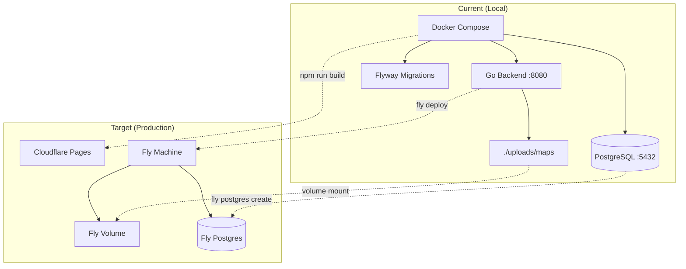

# Hosting Decision Document

> **Date:** 2026-04-02
> **Status:** Implemented
> **Scope:** Hosting strategy for all three application layers (frontend, backend, database)

---

## 1. Introduction & Requirements Summary

This document evaluates hosting options for the PF2E Companion application and recommends a deployment strategy that minimises cost while meeting all technical requirements. The application serves a single private gaming group (1 GM + 2-4 players) and does not require public-scale infrastructure.

### Hard Requirements

| Requirement | Detail |
|---|---|
| **Budget** | <= $10/month total across all layers |
| **WebSocket + WSS** | Mandatory for real-time OT collaboration |
| **Long-running process** | No cold starts or container recycling mid-session |
| **512 MB RAM minimum** | Required for in-memory OT document store (`ot.NewDocumentStore`) |
| **Persistent file storage** | Backend serves files from `./uploads/maps` |
| **TLS termination** | WSS required since the SPA is served over HTTPS |
| **Concurrent connections** | >= 5 simultaneous WebSocket connections |
| **User scale** | 1 GM + 2-4 players (private group, no public access) |

---

## 2. Per-Layer Hosting Requirements

Each application layer has distinct hosting characteristics that must be evaluated separately.

### Frontend (React SPA)

The frontend is a static single-page application built with Vite. It requires only static file hosting with HTTPS support. This layer is an ideal candidate for free-tier CDN hosting -- every major platform offers this at no cost.

### Backend (Go Echo API)

The backend is the most demanding layer. It requires:

- **Persistent process**: The in-memory OT document store accumulates unsaved session state between async database flushes. Cold starts or container recycling would lose in-flight edits.
- **WebSocket support with no connection time limit**: OT editing sessions may last hours. Platforms that forcibly disconnect WebSocket connections create state synchronisation risks.
- **File storage**: Map image uploads are served from a local `./uploads/maps` directory. The hosting solution must provide a persistent filesystem or volume mount.
- **>= 512 MB RAM**: The OT document store, WebSocket connection pool, and Go runtime overhead require at least this amount under normal session load.

### Database (PostgreSQL 16)

The database is low-traffic (single gaming group) with a small dataset. Schema migrations are managed by Flyway, so the PostgreSQL instance must be directly accessible for migration tooling. A managed offering is preferred but not required.

---

## 3. Option Evaluations

### Option A: Fly.io (Backend + DB) + Cloudflare Pages (Frontend)

| Component | Tier | Monthly Cost |
|---|---|---|
| Frontend | Cloudflare Pages Free | $0.00 |
| Backend | shared-cpu-1x, 512 MB RAM | ~$3.32 |
| Backend volume (uploads) | 1 GB @ $0.15/GB | ~$0.15 |
| Database | Fly Postgres (self-managed), shared-cpu-1x, 256 MB, 1 GB volume | ~$2.17 |
| IPv4 (backend) | Dedicated IPv4 | $2.00 |
| **Total** | | **~$7.64** |

**Storage line item:** +$0.15/GB/month for additional map upload storage beyond 1 GB.

**Evaluation:**

- WebSocket/WSS: native support, no connection timeout imposed by proxy
- Long-running process: Fly Machines run continuously when configured as a service (not auto-stopped)
- 512 MB RAM: configurable per machine
- Persistent storage: Fly Volumes mounted at `/app/uploads`
- TLS: automatic via `fly.dev` subdomain or custom domain
- Deployment: `flyctl deploy` from GitHub Actions, Dockerfile-based
- Self-managed Postgres (no managed backups at this tier -- manual `pg_dump` needed)
- Dedicated IPv4 adds $2/month (shared IPv4 via IPv6-to-IPv4 gateway is free but may cause connectivity issues for some clients)

### Option B: Railway (Backend + DB) + Cloudflare Pages (Frontend)

| Component | Tier | Monthly Cost |
|---|---|---|
| Frontend | Cloudflare Pages Free | $0.00 |
| Hobby subscription | Fixed fee | $5.00 |
| Backend compute | Go service (~0.5 vCPU, 512 MB) | Included in $5 credit* |
| Database | PostgreSQL plugin | Included in $5 credit* |
| Volume (uploads) | 1 GB @ ~$0.25/GB | ~$0.25 |
| **Total (low usage)** | | **~$5.25** |
| **Total (moderate usage)** | | **~$7-8** |

*$5 credit covers compute + DB for very low traffic. Overages billed at usage rates.

**Storage line item:** +$0.25/GB/month for additional map upload storage beyond 1 GB.

**Evaluation:**

- WebSocket/WSS: supported on container deployments
- **Connection limit: Railway terminates WebSocket connections after 15 minutes** -- requires client reconnection logic. The app already has reconnection support via `useGameSocket`, but OT document state must survive reconnects cleanly
- Long-running process: container-based, not serverless
- 512 MB RAM: Hobby plan allows up to 8 GB per service
- Persistent storage: Railway Volumes with mount path
- TLS: automatic via `*.up.railway.app` subdomain
- Deployment: GitHub integration with auto-deploy on push
- Managed PostgreSQL: one-click setup, included in usage credits
- Usage-based billing makes exact cost unpredictable month-to-month

### Option C: Render (Backend + DB) + Cloudflare Pages (Frontend)

| Component | Tier | Monthly Cost |
|---|---|---|
| Frontend | Cloudflare Pages Free | $0.00 |
| Backend | Starter ($7/mo, 512 MB, 0.5 CPU) | $7.00 |
| Database | Basic-256mb PostgreSQL | $6.00 |
| Persistent disk (uploads) | 1 GB @ $0.25/GB | ~$0.25 |
| **Total** | | **~$13.25** |

**Storage line item:** +$0.25/GB/month for additional map upload storage beyond 1 GB.

**Evaluation:**

- WebSocket/WSS: first-class support, no arbitrary connection timeout
- Long-running process: persistent "serverful" architecture
- 512 MB RAM: Starter plan provides exactly 512 MB
- Persistent storage: persistent disks as add-on
- TLS: automatic via `*.onrender.com` subdomain
- Deployment: GitHub integration with auto-deploy
- Managed PostgreSQL with backups
- **Exceeds $10/month budget** ($13.25 minimum) -- excluded from recommendation

### Option D (Reference): Hetzner Cloud VPS

| Component | Tier | Monthly Cost |
|---|---|---|
| Frontend | Cloudflare Pages Free | $0.00 |
| VPS (backend + DB) | CX22 (2 vCPU, 4 GB RAM, 40 GB disk) | ~$4.90 |
| **Total** | | **~$4.90** |

**Storage line item:** 40 GB included; map uploads use local disk at no extra cost until disk fills.

**Evaluation:**

- WebSocket/WSS: full control, configure Caddy/nginx for TLS + reverse proxy
- Long-running process: full VM with no platform-imposed limits
- RAM: 4 GB (massively exceeds requirement)
- Persistent storage: local filesystem
- Cheapest option by far
- **Full ops burden**: must self-manage OS updates, PostgreSQL, TLS certs, firewall, backups
- No deployment automation out of the box (must configure GitHub Actions + SSH deploy)
- No managed database -- Flyway migrations run manually or via CI
- Single point of failure, no redundancy

---

## 4. Comparison Matrix

| Criterion | Fly.io | Railway | Render | Hetzner |
|---|---|---|---|---|
| Monthly cost | ~$7.64 | ~$5-8 | ~$13.25 | ~$4.90 |
| Within budget | Yes | Yes | **No** | Yes |
| WebSocket/WSS | Yes | 15-min limit | Yes | Yes |
| Long-running process | Yes | Yes | Yes | Yes |
| >= 512 MB RAM | Yes | Yes | Yes | Yes (4 GB) |
| Persistent file storage | Volumes | Volumes | Disks | Local disk |
| Managed PostgreSQL | Self-managed | One-click | Managed | Self-managed |
| Deployment automation | `flyctl` + GH Actions | Git push deploy | Git push deploy | Manual setup required |
| Ops burden | Low | Low | Low | High |

---

## 5. Recommendation

### Preferred: Option A -- Fly.io + Cloudflare Pages

| Layer | Platform | Cost |
|---|---|---|
| Frontend | Cloudflare Pages (Free) | $0.00 |
| Backend | Fly.io shared-cpu-1x, 512 MB + 1 GB volume | ~$5.47 |
| Database | Fly Postgres shared-cpu-1x, 256 MB + 1 GB volume | ~$2.17 |
| **Total** | | **~$7.64** |

### Reasoning

1. **Fits within budget** at ~$7.64/month with room for moderate storage growth.

2. **No WebSocket connection time limit** -- critical for OT document editing sessions that may last hours. Railway's 15-minute limit is a meaningful risk for the in-memory OT store, as reconnections could cause state synchronisation issues even with the existing `useGameSocket` reconnect logic.

3. **Predictable architecture** -- one Fly Machine runs continuously with a mounted volume for uploads and a co-located Postgres instance. No usage-based billing surprises.

4. **Deployment automation** -- `flyctl deploy` integrates cleanly with GitHub Actions. Dockerfile-based builds align with the existing Docker Compose workflow.

5. **Cloudflare Pages** provides free, globally distributed static hosting with automatic HTTPS -- zero cost for the frontend layer.

### Trade-offs Accepted

- **Self-managed Postgres** requires periodic `pg_dump` backups. This can be automated via a scheduled GitHub Actions workflow or a Fly Machine cron job.
- **Dedicated IPv4 adds $2/month**. This can be avoided by using Fly's shared IPv4 (default) if all players' ISPs support IPv6. If not needed immediately, start without it and add later.
- **Slightly more expensive than Railway's base case**, but eliminates the 15-minute WebSocket reconnection risk that would directly impact the OT collaboration experience.

### Migration Path from Docker Compose

**Backend:**
1. Create a production `Dockerfile` (or reuse the existing one with a multi-stage build)
2. Run `fly launch` to generate `fly.toml`, configure shared-cpu-1x with 512 MB RAM
3. Create a Fly Volume mounted at `/app/uploads/maps`
4. Deploy via `fly deploy`

**Database:**
1. Provision Fly Postgres with `fly postgres create`
2. Run Flyway migrations via a one-off Fly Machine or a CI step in GitHub Actions
3. Set up a scheduled `pg_dump` backup workflow

**Frontend:**
1. Connect Cloudflare Pages to the GitHub repo
2. Configure build: root directory `ui/`, build command `npm run build`, output directory `dist`
3. Set the `VITE_API_BASE_URL` environment variable to point to the Fly.io backend URL

**Environment variables and secrets:**
1. Configure `POSTGRES_*` variables via `fly secrets set`
2. Configure `JWT_SECRET` and any other application secrets
3. Update CORS configuration in the backend to allow the Cloudflare Pages domain

---

## 6. Next Steps

- [x] Review and approve this document
- [x] Create `fly.toml` configuration for the backend
- [x] Create production `Dockerfile` for the Go backend
- [x] Provision Fly Postgres and configure Flyway migration workflow
- [x] Connect `ui/` to Cloudflare Pages
- [x] Configure environment variables and secrets on Fly.io
- [x] Set up GitHub Actions for automated deployment

---

## Notes

- All prices verified as of April 2026
- Hetzner prices reflect post-April 1 2026 pricing adjustment
- Fly.io prices based on US East (iad) region; EU regions may vary slightly
- Railway's $5 credit may or may not fully cover backend + DB depending on actual usage patterns
