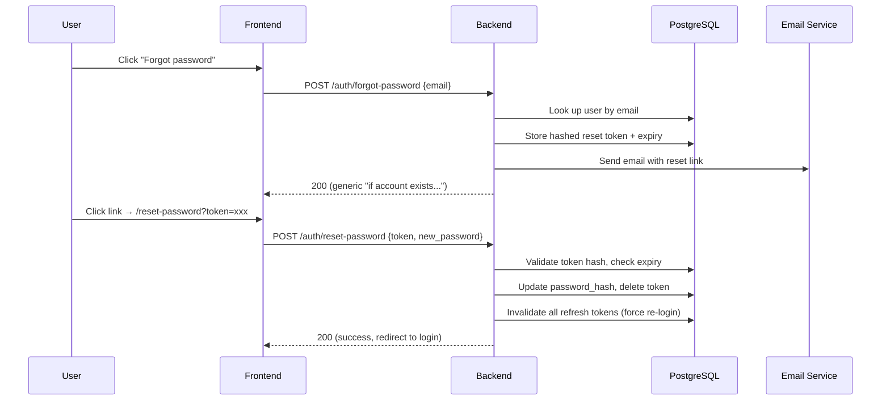
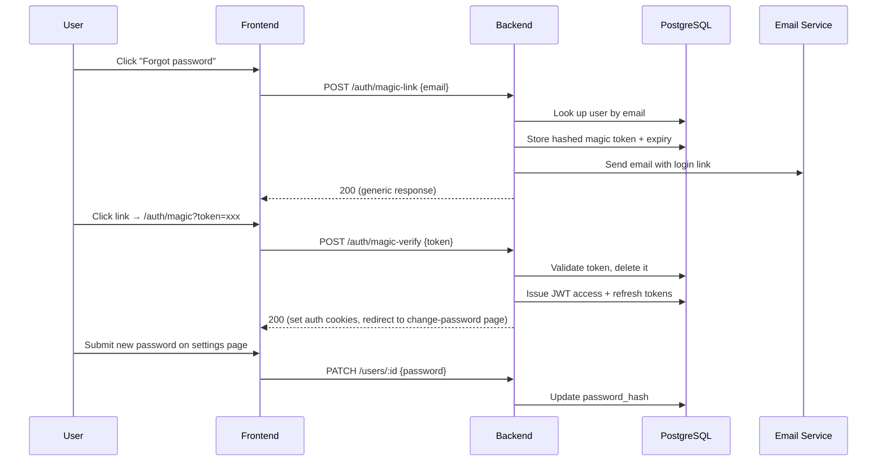
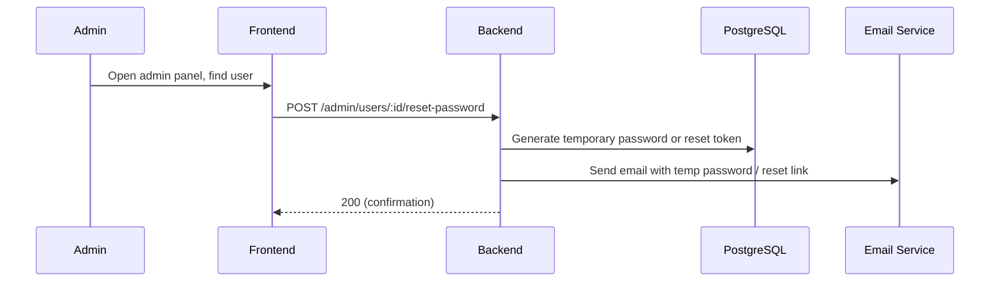

# Password Reset Spike — Decision Document

## 1. System Context Summary

Based on codebase analysis, the following facts ground this evaluation:

| Aspect | Current State |
|---|---|
| **Auth model** | JWT/cookie-based. Access token (15 min, HS256) in `access_token` HttpOnly cookie; refresh token (7 days) in `refresh_token` HttpOnly cookie scoped to `/auth/refresh`. Tokens issued on login/register, rotated on refresh. |
| **Password storage** | bcrypt hash in `users.password_hash` column |
| **User lookup** | `FindByEmail(email)` and `FindByUsername(username)` already exist in `UserRepository` |
| **Rate limiting** | IP-based `RateLimiter` middleware (60 req/min) applied to `POST /auth/login`; per-user `BackupRateLimiter` also exists. Both use Echo's in-memory rate limiter store. |
| **Email delivery** | **None.** No SMTP, SendGrid, Mailgun, SES, or any email service exists in the codebase, environment variables, Docker Compose, or Fly.io config. |
| **Admin/role system** | **None.** No `is_admin`, `role`, or similar concept exists on the `User` model or anywhere in the schema. |
| **Deployment** | Fly.io (single `shared-cpu-1x` / 512 MB), Cloudflare Pages (frontend), PostgreSQL, Docker multi-stage build |
| **Frontend** | React SPA served via Cloudflare Pages, communicates with backend API |

---

## 2. Candidate Options

### Option A — Email-Based Token Reset

**Flow:**

**Layers affected:**
- **Database:** New `password_reset_tokens` table (Flyway migration) — columns: `id`, `user_id`, `token_hash`, `expires_at`, `created_at`
- **Backend — repository:** New `PasswordResetTokenRepository` with `Create`, `FindByTokenHash`, `DeleteByTokenHash`, `DeleteExpiredForUser`
- **Backend — service:** New methods on `AuthService`: `RequestPasswordReset(email)`, `ResetPassword(token, newPassword)`
- **Backend — handler:** Two new public routes: `POST /auth/forgot-password`, `POST /auth/reset-password`
- **Backend — new dependency:** Email sending package (e.g. `github.com/wneessen/go-mail` or a transactional email API client)
- **Infrastructure:** Email delivery service account (SendGrid, Postmark, AWS SES, etc.)
- **Frontend:** New "Forgot password" page, "Reset password" page
- **Middleware:** New rate limiter on `/auth/forgot-password` (stricter than login — e.g. 5 req/15 min per IP)

**Security characteristics:**
- Token is a `crypto/rand` 32-byte value, SHA-256 hashed before DB storage (mirrors existing refresh token pattern)
- Short expiry window (15–30 minutes)
- Single-use: deleted on consumption
- Generic response on forgot-password prevents user enumeration
- Rate limiting on the request endpoint prevents abuse
- Existing `InvalidateAllSessions` can be reused to force re-login after reset

---

### Option B — Magic Link (Passwordless Login for Reset)

**Flow:**

**Layers affected:**
- Same DB/repository/infrastructure as Option A (magic tokens table is structurally identical to reset tokens)
- **Additional complexity:** Must issue a full auth session from the magic link — essentially a second login path
- **Backend — handler:** `POST /auth/magic-link`, `POST /auth/magic-verify` (public), plus the existing user update endpoint needs to support password changes
- **Frontend:** Magic link landing page, redirect logic to change-password UI
- **Security concern:** The magic link effectively becomes a passwordless login vector. If the user doesn't change their password, they remain logged in but the old password is still valid — this is a weaker guarantee than Option A.

**Security characteristics:**
- Same token generation/storage as Option A
- Introduces a second authentication path (token-based login), which expands the attack surface
- User may skip the password change step, leaving the old (forgotten) password in place
- Requires additional UI guardrails (force redirect to password change, or expire session quickly)

---

### Option C — Admin-Initiated Reset

**Flow:**

**Layers affected:**
- **All layers from Option A**, plus:
- **New admin role system:** `is_admin` or `role` column on `users` table, admin middleware, admin-only route group
- **New admin UI:** User management page, reset trigger
- **Backend — handler:** Admin-only endpoint `POST /admin/users/:id/reset-password`
- **Database:** Schema change to add role/admin flag

**Security characteristics:**
- Depends on admin availability — not self-service
- Requires building an entire role-based access control layer that doesn't exist
- Still requires email delivery to notify the user
- Temporary passwords are a known anti-pattern (users often don't change them)

---

## 3. Side-by-Side Comparison

| Criterion | A — Email Token | B — Magic Link | C — Admin Reset |
|---|---|---|---|
| **Implementation effort** | **Medium.** New table, 2 endpoints, email integration. Pattern mirrors existing refresh token flow. | **Medium-High.** Same as A, plus a second login path, redirect logic, and UI guardrails to force password change. | **High.** Requires everything in A + a role/admin system, admin UI, and admin middleware — none of which exist today. |
| **External service dependency** | Email delivery service (new). | Email delivery service (new). | Email delivery service (new). |
| **Security posture** | **Strong.** Single-purpose token, short-lived, single-use, no new login vector. Well-understood industry pattern. | **Moderate.** Introduces passwordless login as a side effect. User may not complete password change. Wider attack surface. | **Moderate.** Depends on admin response time. Temporary passwords are weaker than token-based flows. |
| **Fit with existing JWT/cookie auth** | **Excellent.** Does not alter the auth model. User resets password, then logs in normally. Existing `InvalidateAllSessions` forces re-auth. | **Poor-to-moderate.** Creates a parallel auth path (magic token → JWT session) that bypasses username/password login. Must be carefully scoped to avoid becoming a general passwordless login feature. | **Moderate.** Doesn't alter the auth model itself, but requires a role system bolted on top. |

---

## 4. Recommendation

**Option A — Email-Based Token Reset** is the recommended approach.

### Rationale

1. **Implementation effort:** Option A requires the fewest new concepts. The token generation, hashing, and storage pattern already exists in the codebase (`refresh_tokens` table, `hashToken()` function, `RefreshTokenRepository`). The new `password_reset_tokens` table and repository can follow the identical pattern. Options B and C both require A's work *plus* additional scope.

2. **External service dependency:** All three options require email delivery — this is unavoidable and is the primary prerequisite. Option A introduces no *additional* dependencies beyond email. Option C requires a role system. Option B requires additional UI state management for the forced password-change redirect.

3. **Security posture:** Option A is the strongest. The token is single-purpose (reset only), short-lived, single-use, and does not create a new login vector. Option B's magic link is functionally a passwordless login, which widens the attack surface. Option C's temporary passwords are a known anti-pattern.

4. **Fit with existing auth model:** Option A is the only option that leaves the JWT/cookie auth model completely untouched. The user resets their password and then logs in through the normal `POST /auth/login` flow. Existing `InvalidateAllSessions()` already handles forcing re-authentication after a password change. Options B and C both require modifications to the auth layer.

---

## 5. Known Risks

| Risk | Mitigation |
|---|---|
| **Email delivery is a new infrastructure dependency.** No email service exists today. | Must be provisioned before implementation begins. Recommend a transactional email API (SendGrid, Postmark, or AWS SES) over raw SMTP for deliverability and simplicity. Fly.io has no native email service. |
| **Email deliverability issues (spam filters, delays).** | Use a reputable transactional email provider with SPF/DKIM/DMARC configured on the sending domain. Start with a low-volume plan — the user base is small. |
| **User enumeration via timing or response differences on `/auth/forgot-password`.** | Always return a generic 200 response ("If an account with that email exists, a reset link has been sent") regardless of whether the email exists. Use constant-time comparison where applicable. Apply rate limiting. |
| **Token brute-force attempts on `/auth/reset-password`.** | Use 32-byte `crypto/rand` tokens (256 bits of entropy — computationally infeasible to brute-force). Rate limit the endpoint. Auto-expire tokens after 15–30 minutes. |
| **Replay attacks (reusing a reset link).** | Tokens are single-use — deleted from the database upon successful consumption. |
| **Open redirect via reset link URL.** | The reset link should point to a hardcoded frontend route (e.g. `https://{FRONTEND_ORIGIN}/reset-password?token=xxx`). The `FRONTEND_ORIGIN` should be an environment variable, not user-supplied. |

---

## 6. Prerequisites for Implementation

The following must be satisfied before the implementation work item can begin:

1. **Choose and provision an email delivery service.** Evaluate:
   - **Postmark** — best deliverability for transactional email, simple API, free tier (100 emails/month)
   - **SendGrid** — generous free tier (100 emails/day), well-known, good Go SDK
   - **AWS SES** — cheapest at scale ($0.10/1000 emails), but requires AWS account and domain verification

   Recommendation: **Postmark or SendGrid** for simplicity. Both have official or well-maintained Go client libraries.

2. **Configure a sending domain** with SPF, DKIM, and DMARC records (via Cloudflare DNS, since the frontend is already on Cloudflare Pages).

3. **Add environment variables** for the email service (API key, sender address) to `.env.example`, Fly.io secrets, and `docker-compose.yml`.

4. **Create the Flyway migration** for the `password_reset_tokens` table.

5. **Define the rate limiting strategy** for reset endpoints:
   - `POST /auth/forgot-password`: 5 requests per 15 minutes per IP (stricter than login)
   - `POST /auth/reset-password`: 10 requests per 15 minutes per IP

6. **Add `FRONTEND_ORIGIN` environment variable** for constructing reset link URLs (the backend currently only has `CORS_ALLOW_ORIGIN`, which could be reused but should be explicit).

---

## 7. Implementation Scope (for follow-up work item)

Once the decision is approved and prerequisites are met, the implementation work item should cover:

### Backend
- **Flyway migration:** `password_reset_tokens` table (`id UUID PK`, `user_id UUID FK → users`, `token_hash TEXT UNIQUE`, `expires_at TIMESTAMPTZ`, `created_at TIMESTAMPTZ`)
- **Repository:** `PasswordResetTokenRepository` (Create, FindByTokenHash, DeleteByTokenHash, DeleteExpiredForUser)
- **Service:** Add `RequestPasswordReset(email string) error` and `ResetPassword(token string, newPassword string) error` to `AuthService`
- **Handler:** `POST /auth/forgot-password` (public, rate-limited), `POST /auth/reset-password` (public, rate-limited)
- **Email module:** New `email` package wrapping the chosen provider's API (send templated transactional email)
- **Rate limiter:** Dedicated stricter rate limiter for reset endpoints
- **Background cleanup:** Periodic deletion of expired reset tokens (can piggyback on existing refresh token cleanup pattern)

### Frontend
- "Forgot password?" link on login page
- `/forgot-password` page (email input form)
- `/reset-password` page (new password form, consumes `?token=` query param)
- Success/error states and redirect to login

### Infrastructure
- Email service account provisioned
- DNS records configured
- Environment variables added to all environments

---

## 8. Decision Summary

| | |
|---|---|
| **Chosen approach** | Option A — Email-Based Token Reset |
| **Primary rationale** | Lowest implementation effort, strongest security posture, zero impact on existing auth model |
| **Key prerequisite** | Provision a transactional email delivery service (Postmark or SendGrid recommended) |
| **Follow-up** | Create implementation work item scoped per Section 7 above |
